# Football League Simulation API

A Go REST API that simulates a four-team football league. It supports week-by-week simulation, editing played match results, rolling the league back to a target week, viewing standings and team metrics, and calculating championship probabilities with Monte Carlo simulations.

## Tech Stack

| Area | Choice |
| --- | --- |
| Language | Go 1.26.3 |
| Router | gorilla/mux |
| Database | SQLite via database/sql and go-sqlite3 |
| Migrations | golang-migrate |
| CLI | cobra + viper |
| Tests | Go test + testify |
| Docs | Swagger/OpenAPI generated files under docs/ |

## Project Layout

```text
.
|-- cmd/                    # CLI commands: serve, migrate, seed
|-- database/               # SQLite connection, migrations, seed data, repositories
|-- docs/                   # Swagger/OpenAPI artifacts and Postman collection
|-- handlers/               # HTTP handlers and problem+json errors
|-- middleware/             # logging, panic recovery, rate limiting
|-- models/                 # domain models and repository interfaces
|-- router/                 # route definitions
|-- services/               # league orchestration, simulation, weather, event bus
|-- tests/                  # HTTP integration tests
|-- Dockerfile
|-- docker-compose.yml
|-- Makefile
|-- openapi.yaml             # Importable OpenAPI spec for quick reviewer testing
|-- go.mod
`-- main.go
```

## Running Locally

```bash
go run . migrate up
go run . seed
go run . serve
```

The API listens on `http://localhost:8080` by default.

Swagger UI is available at:

```text
http://localhost:8080/swagger/index.html
```

For deterministic demo data, run with a seed:

```bash
SIM_SEED=42 go run . serve
```

## Running With Docker

```bash
docker compose up --build
```

or:

```bash
make docker-run
```

The container runs migrations, seeds the database, then starts the server.

Docker Compose sets `SIM_SEED=42` so local demos are repeatable.

## Deployment

The repository includes a Render blueprint in `render.yaml`. The current deployed service is:

```text
Live API: https://insider-one-backend-project.onrender.com
Swagger: https://insider-one-backend-project.onrender.com/swagger/index.html
```

The Postman collection uses a `base_url` variable. It defaults to the deployed Render URL and can be switched to `http://localhost:8080` for local review.

## Environment Variables

| Variable | Default | Description |
| --- | --- | --- |
| `PORT` | `8080` | HTTP server port |
| `DB_PATH` | `./league.db` | SQLite database file path |
| `SIM_SEED` | empty | Optional integer seed for repeatable weather and match simulation |

Copy `.env.example` when you want a local template for environment configuration.

## Architecture Flow

```mermaid
flowchart LR
    A["HTTP request"] --> B["Router and middleware"]
    B --> C["Request validation"]
    C --> D["Handler"]
    D --> E["Service lock"]
    E --> F["SQL transaction"]
    F --> G["Repositories"]
    G --> H["Rebuild standings and team metrics"]
    H --> I["Invalidate prediction cache"]
    I --> J["Publish domain event"]
    J --> K["JSON or problem+json response"]
```



Mutating endpoints follow this flow so edits, rollback, reset, and simulations do not leave partial state behind. Read endpoints use the same repository and ranking functions, while championship probabilities reuse the shared ranking logic inside the Monte Carlo loop. The internal event bus emits operational domain events such as `week_played`, `match_edited`, `rollback_completed`, `standings_rebuilt`, and `prediction_cache_invalidated`.

## Make Targets

```bash
make build       # Build the binary
make run         # Build, migrate, seed, and serve
make test        # Run the full test suite
make bench       # Benchmark championship probability generation and cache reads
make swagger     # Regenerate Swagger artifacts
make docker-run  # Start with Docker Compose
make clean       # Remove local build/database files
```

## API Endpoints

| Method | Endpoint | Description |
| --- | --- | --- |
| `GET` | `/api/v1/league/table` | Current standings |
| `GET` | `/healthz` | Root liveness probe for platform health checks |
| `GET` | `/readyz` | Root readiness probe that verifies database connectivity |
| `GET` | `/api/v1/health` | API-scoped liveness probe |
| `GET` | `/api/v1/league/overview` | Current standings, weekly match status, and predictions when available |
| `POST` | `/api/v1/league/next-week` | Simulate the next scheduled week |
| `POST` | `/api/v1/league/play-all` | Simulate all remaining weeks |
| `GET` | `/api/v1/matches/{id}` | Get a match and its events |
| `PUT` | `/api/v1/matches/{id}` | Edit a match score and rebuild league state |
| `GET` | `/api/v1/simulation/championship-probabilities` | Run championship probability simulations |
| `POST` | `/api/v1/league/rollback/{week}` | Reset matches from the target week onward |
| `GET` | `/api/v1/teams/{id}/metrics` | Get strength, morale, fatigue, and market value |
| `POST` | `/api/v1/league/reset` | Recreate teams, players, standings, and schedule |

The importable OpenAPI spec is also available at `openapi.yaml` in the repository root.

## Domain Rules

- Four teams play a six-week double round-robin schedule.
- A win is worth 3 points, a draw 1 point, and a loss 0 points.
- Standings are ordered by points, goal difference, goals for, then tied-team head-to-head rules where available.
- Match simulation uses team strength, morale, fatigue, weather, and home advantage.
- Editing a match result triggers a full state rebuild.
- Rollback resets matches and events from the target week onward, then rebuilds standings and team metrics.
- Championship probabilities are available after enough weeks have been played and are cached until league state changes.

## Data Model

The schema has five main tables:

```text
teams         id, name, market_value, base_strength, current_strength, morale, fatigue, city
players       id, team_id, name, position
matches       id, week, home_team_id, away_team_id, home_score, away_score, weather_condition, status
match_events  id, match_id, player_id, event_type, minute, detail
standings     team_id, played, won, drawn, lost, gf, ga, gd, points
```

Migrations live in `database/migrations`.

Detailed schema notes and key repository queries are documented in `docs/sql.md`.

Championship probability logic is documented in `docs/simulation.md`.

## Consistency And Error Handling

The service serializes league state mutations with an application-level lock. Multi-table write operations such as playing a week, editing a result, rollback, and reset are wrapped in SQL transactions so partial state is not committed if a step fails.

Repository methods use `context.Context`, and database scan/write errors are returned to callers instead of being silently ignored.

Routed HTTP responses include an `X-Request-ID` header. Incoming request IDs are preserved for trace correlation, and missing IDs are generated by middleware and included in structured request logs. Request logs include both `duration` and numeric `duration_ms` fields.

Request validation is centralized in handler helpers for strict JSON decoding, content type checks, path ID parsing, rollback bounds, and score sanity before service mutations run.

Rollback responses include a summary with the target week, reset match count, reset weeks, standings recalculation status, team-metric rebuild status, and prediction-cache invalidation status.

## Testing

Run:

```bash
go test ./...
go vet ./...
go build ./...
make bench
```

The test suite includes:

- unit tests for the match engine and league service behavior;
- HTTP integration tests for the main league lifecycle;
- a regression test proving week 6 can be simulated and week 7 is rejected.
- negative-path tests for malformed JSON, invalid IDs, invalid edits, duplicate rollback, and rebuild consistency.
- Championship probability benchmarks covering fresh prediction generation and cached reads.
- health/readiness probes and request ID middleware behavior.

## Example Requests

```bash
curl http://localhost:8080/api/v1/league/table

curl http://localhost:8080/api/v1/league/overview

curl -X POST http://localhost:8080/api/v1/league/next-week

curl -X POST http://localhost:8080/api/v1/league/play-all

curl http://localhost:8080/api/v1/simulation/championship-probabilities

curl -X PUT http://localhost:8080/api/v1/matches/1 \
  -H "Content-Type: application/json" \
  -d '{"home_score": 3, "away_score": 0}'

curl -X POST http://localhost:8080/api/v1/league/rollback/3
```

## Notes For Reviewers

This is a compact internship-case backend, not a production service. The code now favors clear service/repository boundaries, explicit error handling, transactional writes, and runnable local/Docker workflows. Reasonable next improvements would be broader negative-path tests, stricter request validation, request-scoped rate limiting, and reducing generated Swagger artifacts in normal review diffs.
